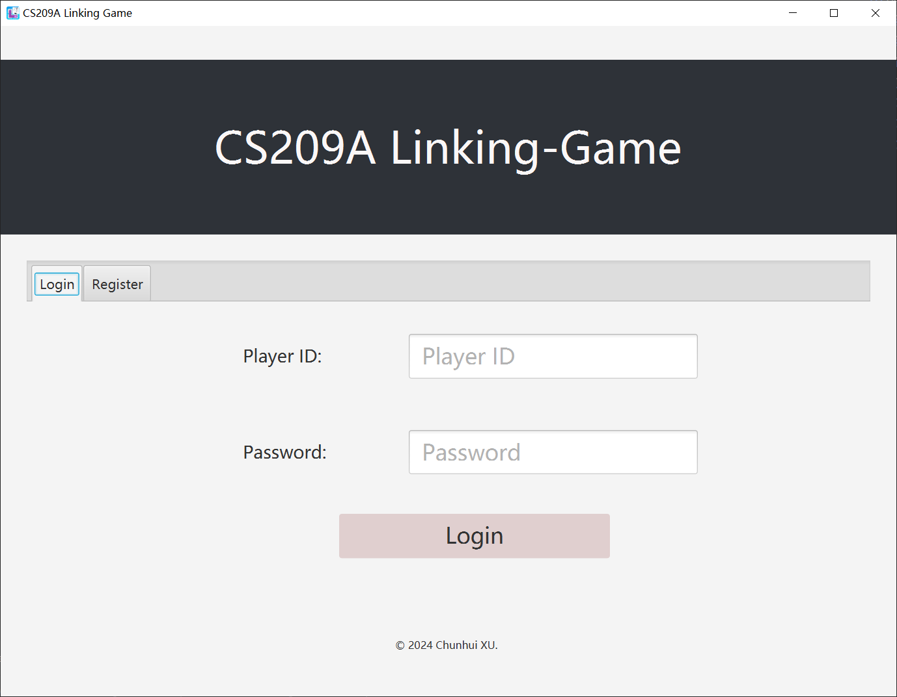
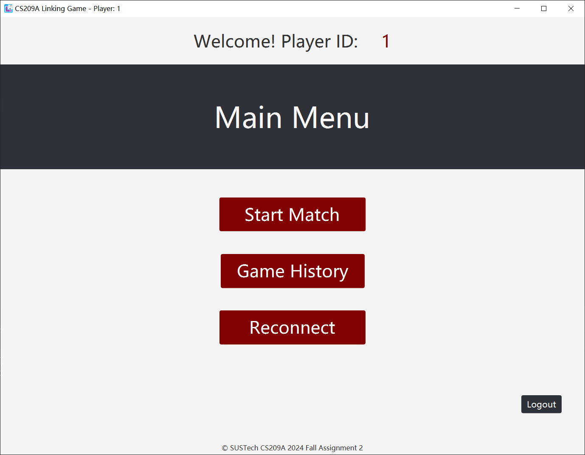
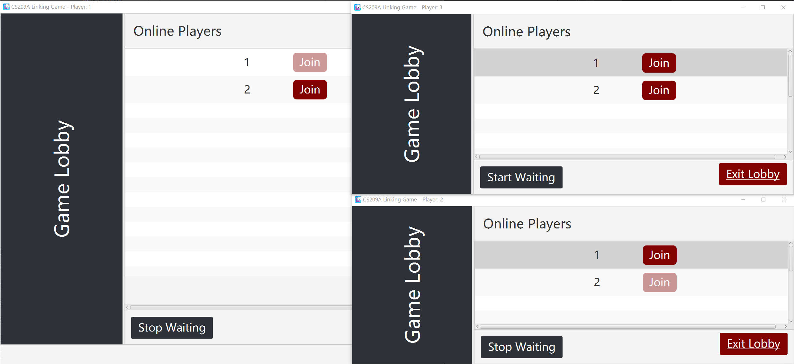
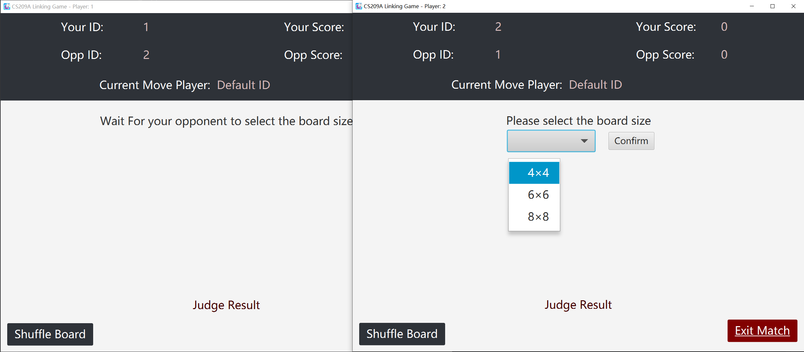
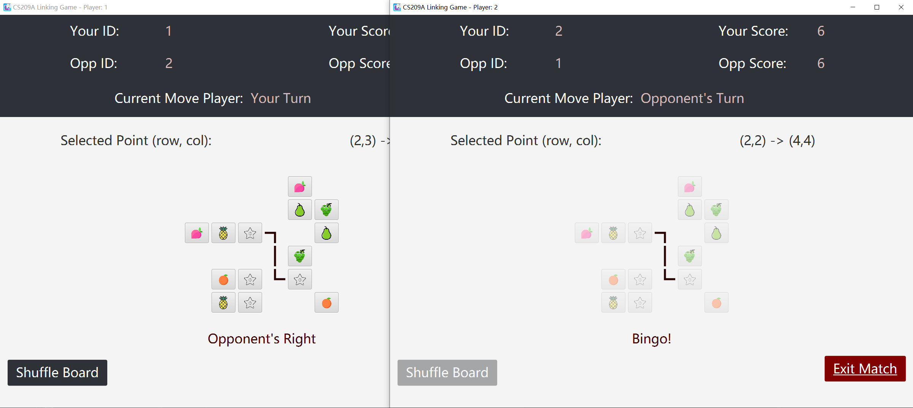
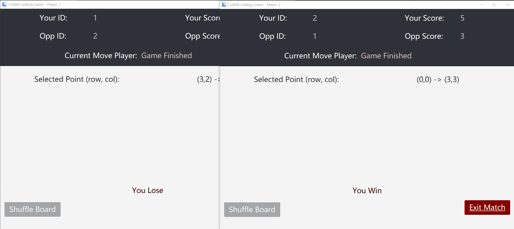
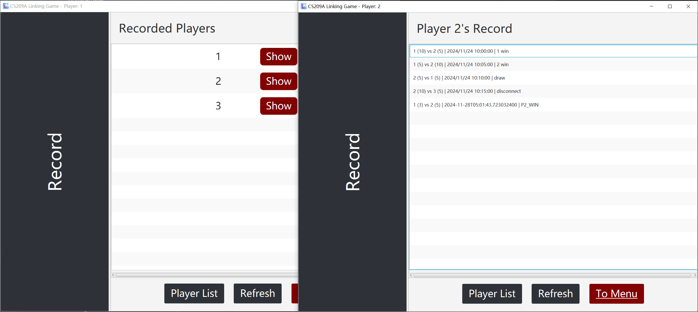

# SUSTech-CS209A-Linking-Game

(JavaFX 23 + Java socket) Linking Game (a.k.a. “连连看”) using JavaFX 23 with simple online. 

SUSTech CS209A 2024 Fall Assignment 2.

### Documentation

- [requirement.pdf](docs/requirement.pdf)
- [grading_criteria.xlsx](docs/grading_criteria.xlsx) or [grading_criteria_CHS.xlsx](grading_criteria_CHS.xlsx)

I completed both the basic and bonus features.

### About

A toy game. I wrote it almost in one go, and by the end the project structure was a little messy. 

There may be some minor bugs, witch I don't have the energy to fix :((

### Modules

- [game-common](game-common/): common model for both client and server.
    - controller: JavaFX `.fxml` file's controllers
    - net: Singletons for managing a client's different kinds of data

- [game-client](game-client/): JavaFX game client application
    - model: Different models for C/S transmission through `ObjectI/OStream`
    - packet: General `Request` / `Response` model

- [game-server](game-server/): Java socket game server
    - net: Singletons for managing different kinds of data for all clients

### Login / Register

There are 3 pre-define users:

- "1" , "1"
- "2" , "2"
- "2" , "2"

### Main Menu

### Start Matching (Lobby)

### Choose Size

A random player to choose size.

### Link!

Lines key frame animation for both players.

You can shuffle for a new shape of grids.

### Game Result

### Match Record

No beautification.

